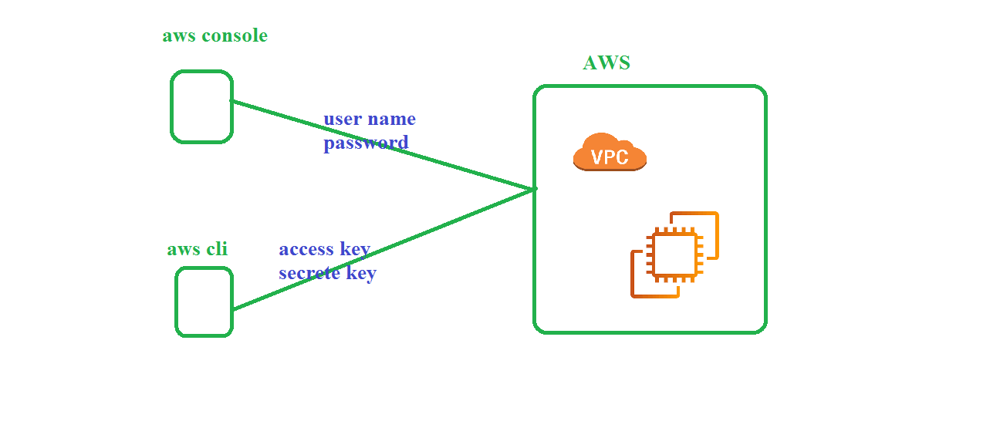

## pending 
  1. vpn
  2. direct connect
  3. security: 
      1. NACL
      2. security group
  4. transit gateway: vpc peering 
## AWS CLI 

   1. Lab setup 
      1. install awscli 
         ```
         choco install awscli -y
         sudo apt-get update && sudo apt-get install awscli -y
         ``` 
      2. create IAM user 
         1. goto service
         2. search for IAM
         3. create user 
      [click here IAM](https://github.com/ABBANAPURI0445/devops-aws/blob/master/AWS/AWS%20CLI/aws-clI.md)
      3. configure aws cli 
         1. open powershell as admin
         2. run below command
            ```
            aws configure
            ```
         3. fill the values 
## create VPC using aws cli 
   1. open documentaion aws vpc cli reference 
   ```
   aws ec2 create-vpc --cidr-block 192.168.0.0/16
   ```
   2. delete vpc 
      ```
      aws ec2  delete-vpc --vpc-id vpc-0954ef2199f7e622e
      ``` 
## create complete VPC 
   1. create vpc  # vpc-0939d81edcfeaf199
      ```
      aws ec2 create-vpc --cidr-block 192.168.0.0/16
      ``` 
   2. create internet gateway #  igw-0f38c3c7d027132f5
       ```
       aws ec2 create-internet-gateway
       ``` 
   3. igw attach to VPC 
      ```
      aws ec2 attach-internet-gateway --internet-gateway-id igw-0f38c3c7d027132f5  --vpc-id vpc-0939d81edcfeaf199
      ```
   4. create Public RT 
      1. create RT # rtb-01fec14033e49d520
         ```
         aws ec2 create-route-table --vpc-id vpc-0939d81edcfeaf199
         ```
      2. routed to IGW 
         ```
         aws ec2 create-route --route-table-id  rtb-01fec14033e49d520 --destination-cidr-block 0.0.0.0/0 --gateway-id igw-0f38c3c7d027132f5
         ``` 
   5. create public subnet
      1. create subnet # subnet-0f9ef738073f37f41
         ```
         aws ec2 create-subnet --vpc-id vpc-0939d81edcfeaf199 --cidr-block 192.168.0.0/24
        ```
      2. associate to Public RT 
         ```
         aws ec2 associate-route-table  --route-table-id rtb-01fec14033e49d520  --subnet-id subnet-0f9ef738073f37f41

      
         ``` 
   6. create security group 
      1. create sg # sg-0025b53b8438e4d72
         ```
         aws ec2 create-security-group --description "open all" --group-name "allowport" --vpc-id vpc-0939d81edcfeaf199
      2. add rules (ingress and engress) 
         ```
         aws ec2 authorize-security-group-ingress  --group-id sg-0025b53b8438e4d72 --protocol tcp --port 22 --cidr 0.0.0.0/0
         ```
         ```
         
         aws ec2 authorize-security-group-egress --group-id sg-0025b53b8438e4d72 --ip-permissions IpProtocol=tcp,FromPort=80,ToPort=80,IpRanges='[{CidrIp=192.168.0.0/16}]
         ```
   7. launch ec2 machine in public subnet ## i-0a94775a8fb40a951
      ```
      aws ec2  run-instances --image-id  ami-0e82959d4ed12de3f --instance-type t2.micro --key-name vpc-ec2-key --security-group-ids sg-0025b53b8438e4d72 --subnet-id subnet-0f9ef738073f37f41 --associate-public-ip-address
      ``` 

## delete everything by using awscli

```
aws ec2 terminate-instances --instance-ids i-0a94775a8fb40a951

aws ec2 delete-security-group --group-id sg-0025b53b8438e4d72

aws ec2 delete-subnet --subnet-id subnet-0f9ef738073f37f41

aws ec2 delete-route-table --route-table-id rtb-01fec14033e49d520

aws ec2 detach-internet-gateway --internet-gateway-id igw-0f38c3c7d027132f5 --vpc-id vpc-0939d81edcfeaf199

aws ec2 delete-internet-gateway --internet-gateway-id igw-0f38c3c7d027132f5

aws ec2 delete-vpc --vpc-id vpc-0939d81edcfeaf199

```
